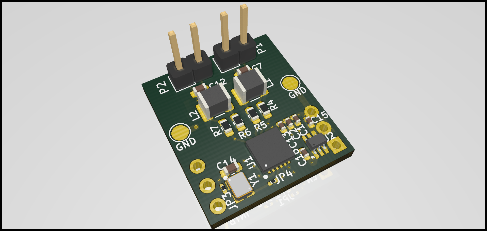
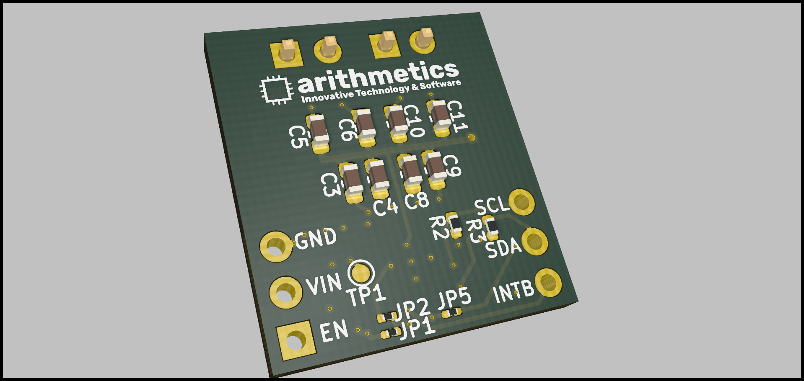

# Breakout Board: FDC2212 EMI-Resistant 28-Bit Capacitance-to-Digital Converter for Proximity and  Level Sensing Application
## Description

Capacitive sensing is a low-power, low-cost, high-resolution contactless sensing technique that can be applied to a variety of applications ranging from proximity detection and gesture recognition to remote liquid level sensing. The sensor in a capacitive sensing system is any metal or conductor, allowing for low cost and highly flexible system design. The main challenge limiting sensitivity in capacitive sensing applications is noise susceptibility of the sensors. With the FDC2x1x innovative EMI resistant
architecture, performance can be maintained even in presence of high-noise environments.

The FDC2x1x is a multi-channel family of noise-and EMI-resistant, high-resolution, high-speed capacitance-to-digital converters for  implementing capacitive sensing solutions. The devices employ an innovative narrow-band based architecture to offer high rejection of noise and interferers while providing high resolution at highspeed. The devices support a wide excitation frequency range, offering flexibility in system design. A wide frequency range is especially useful for reliable sensing of conductive liquids such as detergent, soap, and ink.

## Features

- Texas Instruments FDC2212
- CTS Model 625 - 40MHz ultra-low voltage clock oscillator
-  SiP3243 - Ultra Low Leakage Load Switch

